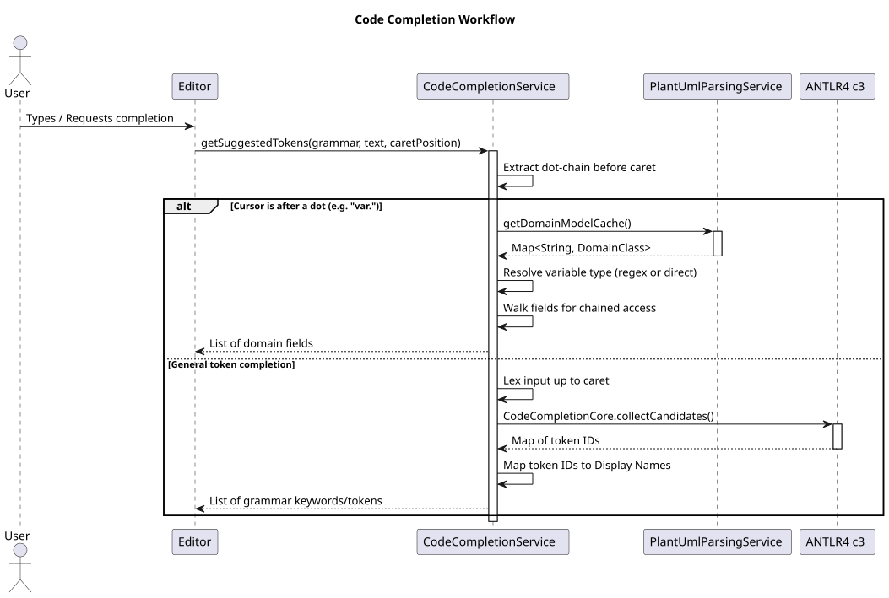

# Code Completion Workflow

This document explains the hybrid code completion strategy used in `geantlr`, which seamlessly integrates standard grammar-based token suggestion with domain-model dot-accessor completion.

**Source Code:** [`src/main/java/org/geantlr/services/CodeCompletionService.java`](../src/main/java/org/geantlr/services/CodeCompletionService.java)

## Overview

A purely grammar-based approach (using tools like ANTLR4-c3) is excellent for predicting keywords and structural tokens (e.g., `if`, `else`, `{`). However, it fails for domain-specific dot-accessors (e.g., typing `user.` and expecting `firstName`).

`geantlr` solves this by inspecting the cursor context before delegating to the completion engine.

## Sequence Diagram

The following sequence diagram illustrates the decision tree when a user requests code completion.

*(If viewing the source `.puml`, render using: `java -jar plantuml.jar docs/diagrams/code_completion.puml`)*

## The Two Modes

### 1. Domain Model Completion (Dot-Accessor)

When the cursor is immediately preceded by a dot (`.`), the service switches to a text-based, grammar-independent resolution strategy:

1.  **Extract Chain:** It walks backwards from the caret to extract the identifier chain (e.g., `ctx.datenpunkt.`).
2.  **Resolve Base Type:** It attempts to resolve the base identifier (`ctx`) to a known domain class. This is done by:
    *   Checking if the identifier itself is a known class name.
    *   Scanning the text for variable declarations matching the pattern `ClassName varName`.
3.  **Walk the Graph:** It uses the `PlantUmlParsingService`'s cached domain model to follow the property chain. If `ctx` is of type `Context` and `Context` has a field `datenpunkt` of type `Datenpunkt`, it resolves the next step.
4.  **Suggest:** It returns the valid fields for the final resolved type.

### 2. Grammar Token Completion

If the cursor is *not* after a dot, the service delegates to standard ANTLR analysis:

1.  **Lexing:** The input text is lexed up to the caret position to identify the current token index.
2.  **C3 Engine:** The `antlr4-c3` (Code Completion Core) library is invoked with the parser interpreter and token stream.
3.  **Vocabulary Mapping:** The C3 engine returns a collection of expected token IDs. The service uses the grammar's `Vocabulary` to map these IDs back to human-readable strings (e.g., mapping `TOK_IF` to `if`).
