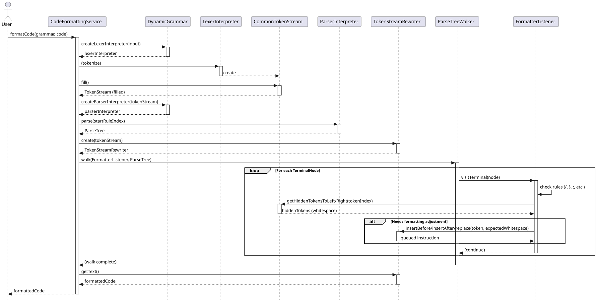

# Code Formatting Workflow

This document explains the architecture and process used by `geantlr` to format Domain-Specific Language (DSL) code dynamically.

**Source Code:** [`src/main/java/org/geantlr/services/CodeFormattingService.java`](../src/main/java/org/geantlr/services/CodeFormattingService.java)

## Overview

Unlike standard formatters that parse code into an Abstract Syntax Tree (AST), rebuild the tree from scratch, and serialize it back to string (which often destroys comments and original whitespace), `geantlr` uses **Non-Destructive Code Formatting**.

This is achieved using ANTLR's `TokenStreamRewriter`, which allows the formatting service to selectively modify, insert, or delete hidden channel tokens (such as whitespace and newlines) while leaving the original AST and visible tokens completely untouched.

## Sequence Diagram

The following sequence diagram illustrates the step-by-step data flow when `formatCode()` is invoked.

*(If viewing the source `.puml`, render using: `java -jar plantuml.jar docs/diagrams/code_formatting.puml`)*

## The Formatting Process

1. **Lexing & Parsing**
   The raw code is passed through the dynamically loaded ANTLR `LexerInterpreter` to generate a `CommonTokenStream`. This stream contains all tokens, including hidden tokens like whitespace and comments. The stream is then parsed to generate a `ParseTree`.

2. **The Rewriter Initialization**
   A `TokenStreamRewriter` is instantiated, wrapping the `CommonTokenStream`. This rewriter acts as an instruction queue for modifications to the token stream.

3. **Tree Walking (`FormatterListener`)**
   A `ParseTreeWalker` is used to traverse the AST with a custom `FormatterListener`. As the walker visits each terminal node, the listener applies indentation and spacing rules based on the token text (e.g., `{`, `}`, `;`, `,`).

4. **Hidden Token Modification**
   Instead of changing the visible tokens, the listener inspects the *hidden* tokens (whitespace) to the left and right of the current terminal token. If the existing whitespace does not match the expected formatting (e.g., incorrect indentation or missing spaces), it issues commands to the `TokenStreamRewriter` (like `insertBefore`, `replace`, or `delete`) to adjust the hidden channels.

5. **Result Generation**
   After the entire tree has been walked, the service calls `rewriter.getText()`. The rewriter applies all queued modifications to the token stream and returns the formatted string, preserving original comments and unformatted structural elements.
