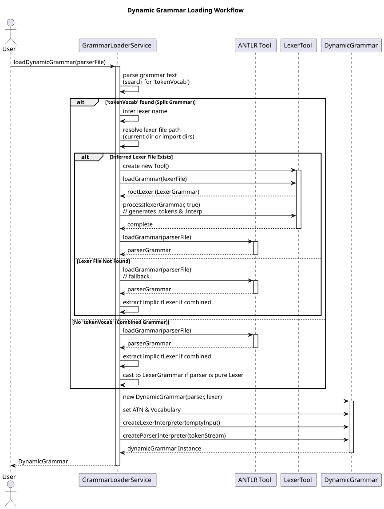

# Dynamic Grammar Loading Workflow

This document outlines the strategy used by `geantlr` to dynamically load ANTLR 4 grammars at runtime, specifically focusing on the multi-pass resolution for split (lexer/parser) grammars and complex directory imports.

**Source Code:** [`src/main/java/org/geantlr/services/GrammarLoaderService.java`](../src/main/java/org/geantlr/services/GrammarLoaderService.java)

## Why a Custom Loading Strategy?

Loading an ANTLR grammar dynamically using the `Tool` API is straightforward for combined grammars (e.g., `MyLang.g4`). However, when grammars are split into a Lexer (`MyLangLexer.g4`) and a Parser (`MyLangParser.g4`), the standard API struggles if the generated `.tokens` and `.interp` files are not present in the correct paths.

To support robust, on-the-fly loading without requiring the user to manually compile grammars beforehand, `GrammarLoaderService` employs a specialized two-step resolution process.

## The Two-Step Load Process

1.  **Lexer Inference and Processing (Step 1)**
    When a parser grammar is loaded, the service scans its contents for a `tokenVocab` declaration.
    If found, it infers the name of the corresponding lexer grammar and attempts to locate it in the current directory or explicitly configured import directories.
    If the lexer file is found, it uses a dedicated `Tool` instance to parse the lexer and **processes it** (`lexerTool.process(lexerGrammar, true)`). This crucial step generates the necessary dependency files (`.tokens`) in the output directory.

2.  **Parser Resolution (Step 2)**
    Once the lexer is processed and the vocabulary is established, the service loads the parser grammar. The parser seamlessly picks up the newly generated token vocabulary.
    If the grammar is a combined grammar (no `tokenVocab`), this step runs directly, and the implicit lexer is extracted from the result.

## Dependency Injection and Import Directories

The `GrammarLoaderService` allows registering multiple "import directories". A custom `org.antlr.v4.Tool` subclass is implemented to override `getImportedGrammarFile()`. This allows the ANTLR runtime to resolve grammar dependencies (like `import BaseLexer;`) across multiple arbitrary folders, rather than just the immediate sibling directory.

## Sequence Diagram

The following sequence diagram illustrates the decision tree and interaction between the service, the ANTLR Tool APIs, and the resulting `DynamicGrammar` model.

*(If viewing the source `.puml`, render using: `java -jar plantuml.jar docs/diagrams/grammar_loading.puml`)*
