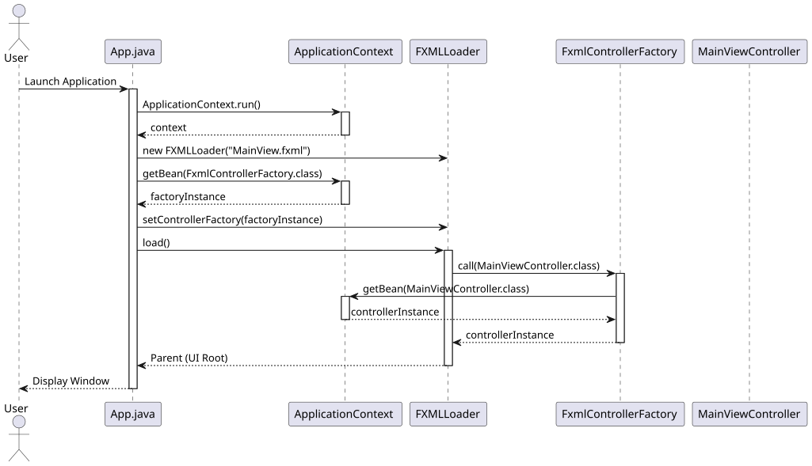

# JavaFX and Micronaut DI Integration

This document explains how the `geantlr` application integrates the Micronaut Dependency Injection (DI) framework with the JavaFX UI lifecycle.

**Source Code:**
*   [`src/main/java/org/geantlr/App.java`](../src/main/java/org/geantlr/App.java)
*   [`src/main/java/org/geantlr/FxmlControllerFactory.java`](../src/main/java/org/geantlr/FxmlControllerFactory.java)

## Overview

JavaFX uses the `FXMLLoader` to instantiate controllers defined in `.fxml` layout files. By default, the loader uses reflection to call the no-argument constructor of the designated controller class. However, in our MVVM architecture, controllers are not isolated; they require their respective ViewModels, styling services, and domain components to be injected.

To bridge this gap, we configure the `FXMLLoader` to delegate controller instantiation to Micronaut's `ApplicationContext`. This turns every JavaFX controller into a fully-managed Micronaut bean, allowing standard `@Inject` constructor injection.

## Sequence Diagram

The following sequence diagram illustrates the application startup and the DI injection process:



*(If viewing the source `.puml`, render using the PlantUML tool.)*

## Key Components

### 1. `App.java` (Lifecycle Hook)
During the JavaFX application's `init()` phase (which runs before the primary UI thread is displayed), the Micronaut `ApplicationContext.run()` is invoked to scan and wire all `@Singleton` and `@Prototype` beans in the application. The context is retained as an instance variable.

### 2. `FxmlControllerFactory.java`
This class implements the JavaFX `Callback<Class<?>, Object>` interface. It is annotated as a Micronaut `@Singleton` itself. Its sole responsibility is to take a requested class type from the `FXMLLoader` and retrieve the fully-injected instance from the Micronaut context:
```java
@Override
public Object call(Class<?> clazz) {
    return context.getBean(clazz);
}
```

### 3. `FXMLLoader` Configuration
In the `start()` method of `App.java`, before calling `loader.load()`, the application retrieves the factory from Micronaut and sets it as the controller factory for the loader:
```java
FXMLLoader fxmlLoader = new FXMLLoader(App.class.getResource("/org/geantlr/views/MainView.fxml"));
fxmlLoader.setControllerFactory(context.getBean(FxmlControllerFactory.class));
```

This simple delegation ensures that when `MainView.fxml` specifies `fx:controller="org.geantlr.views.MainViewController"`, Micronaut seamlessly injects dependencies like `MainViewModel` and `IGrammarLoaderService` into the controller before it is returned to the UI engine.
