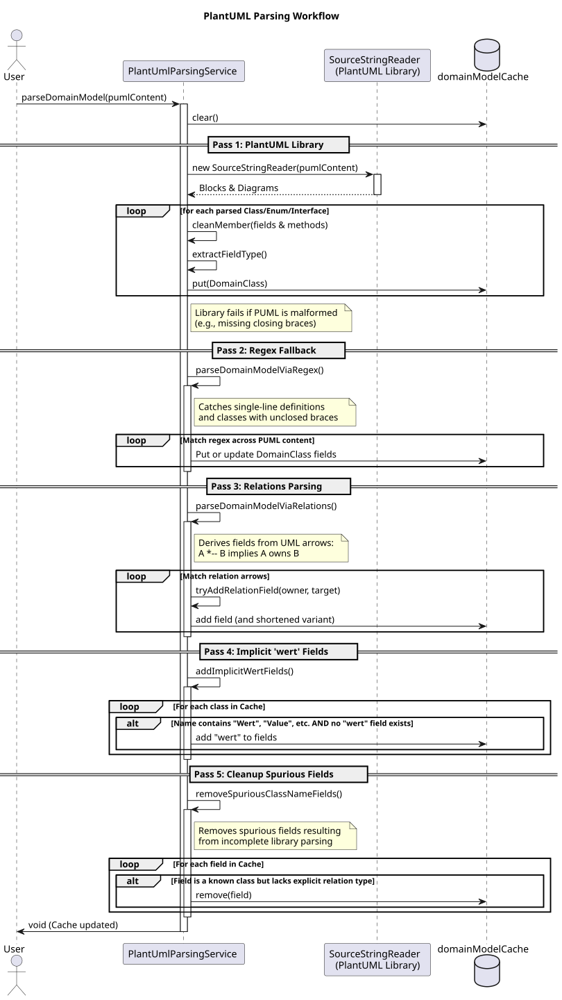

# PlantUML Parsing Workflow

This document explains the multi-pass domain model parsing strategy used in `geantlr` to extract class structures and relationships from PlantUML diagrams.

**Source Code:** [`src/main/java/org/geantlr/services/PlantUmlParsingService.java`](../src/main/java/org/geantlr/services/PlantUmlParsingService.java)

## Why Multiple Passes?

Parsing PlantUML robustly is challenging because the language is highly flexible. Diagrams often contain single-line class definitions, unclosed braces, or implicit relationships defined purely via association arrows (e.g., `A *-- B`).

The standard PlantUML library (`net.sourceforge.plantuml`) is excellent for fully-formed, strict UML, but can fail or silently drop classes if the syntax is slightly malformed or incomplete. To provide a resilient auto-completion experience, `geantlr` uses a five-pass hybrid parsing strategy:

1.  **Pass 1: Library Parsing (Strict)**
    Uses the official PlantUML library to extract explicitly declared classes, interfaces, enums, fields, and their types. This is the primary source of truth for well-formed diagrams.

2.  **Pass 2: Regex Fallback (Permissive)**
    Scans the diagram using regular expressions to find classes the library missed. This pass specifically targets single-line definitions and blocks with missing closing braces `}`. It merges discovered fields with the existing cache.

3.  **Pass 3: Relational Inference**
    Parses UML relation arrows (e.g., `*--`, `o--`, `-->`). If class `A` owns or points to class `B`, a new field of type `B` is added to `A`. The field name is derived from `B`'s name in camelCase. It also attempts to create "shortened" variants by stripping common suffixes like `Ref`, `DTO`, `VO`, etc.

4.  **Pass 4: Implicit 'wert' Fields**
    Some domains use wrapper objects for values (e.g., classes containing `Wert`, `Value`, or `Quelle`). If such a class doesn't explicitly declare a `wert` field, one is implicitly added to support dot-accessor chaining (e.g., `field.wert`).

5.  **Pass 5: Artifact Cleanup**
    Because the library parsing can misinterpret standalone class names as fields when braces are missing, this pass scans the cache for "spurious fields". If a field's name matches a known domain class but lacks an explicit type declaration from Pass 1 or 2, it is removed.

## Sequence Diagram

The following sequence diagram illustrates the step-by-step data flow through these passes when `parseDomainModel()` is invoked.

*(If viewing the source `.puml`, render using: `java -jar plantuml.jar docs/diagrams/plantuml_parsing.puml`)*
