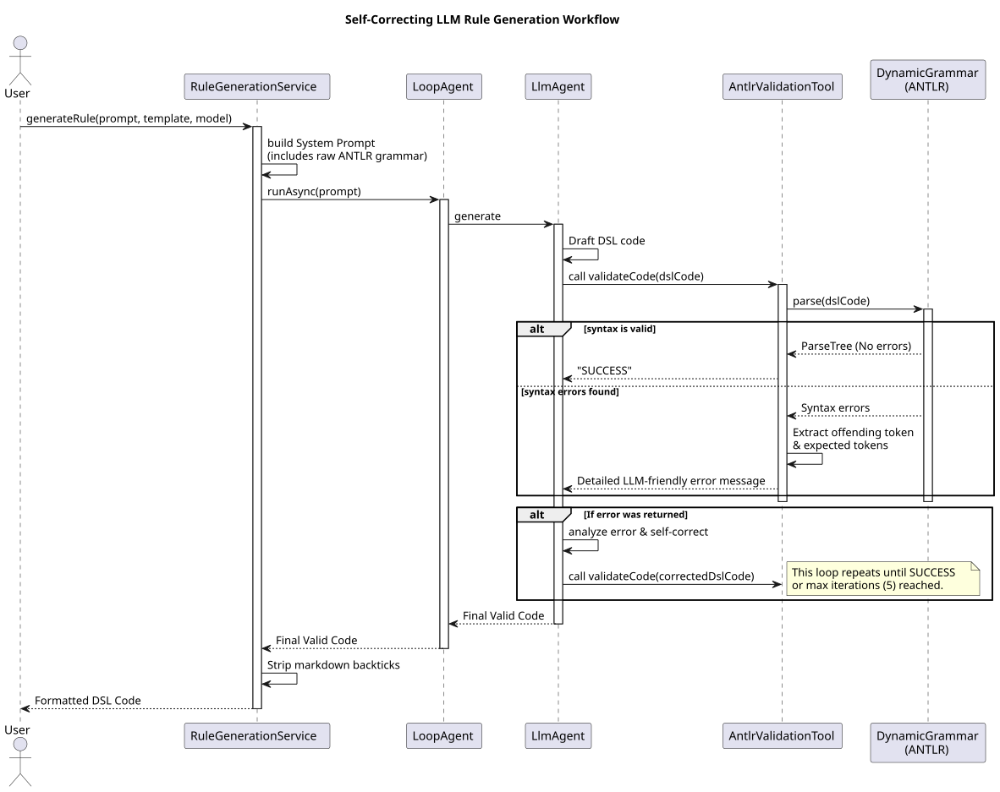

# Rule Generation Workflow

This document outlines the workflow used by `geantlr` to autonomously generate and self-correct DSL (Domain-Specific Language) rules using a local Large Language Model (LLM).

**Source Code:**
*   [`src/main/java/org/geantlr/services/RuleGenerationService.java`](../src/main/java/org/geantlr/services/RuleGenerationService.java)
*   [`src/main/java/org/geantlr/services/AntlrValidationTool.java`](../src/main/java/org/geantlr/services/AntlrValidationTool.java)

## Overview

The goal of the rule generation process is to take a natural language prompt from a user and generate syntactically perfect DSL code that conforms to the currently loaded ANTLR grammar.

Because LLMs (even advanced ones) frequently produce syntax errors when generating novel DSLs, the system employs an Agentic Loop (via LangChain4j and ADK) where the LLM can test its own code against the actual ANTLR parser before returning the final result to the user.

## Sequence Diagram

The following sequence diagram illustrates the workflow of the self-correcting generation loop.

*(If viewing the source `.puml`, render using the PlantUML tool.)*

## Key Components

### 1. Context Injection (`RuleGenerationService`)
Before asking the LLM to write code, the service injects the entire raw ANTLR grammar (from the `DynamicGrammar` instance) into the system prompt. If the user provided a reference template, this is also injected with strict instructions to copy the structure, not the domain logic.

### 2. Autonomous Loop (`LoopAgent`)
The system uses a `LoopAgent` with a maximum of 5 iterations. This allows the LLM to try, fail, get feedback, and try again without user intervention.

### 3. The Validation Tool (`AntlrValidationTool`)
This is the core of the self-correction mechanism. It is exposed to the LLM as a callable function (`validateCode`).
When the LLM calls this function with its drafted code:
1. The tool parses the code using the loaded `DynamicGrammar` interpreter.
2. A custom `LlmFeedbackErrorListener` intercepts any ANTLR `RecognitionException`.
3. The listener extracts the exact line, column, offending token, and the `IntervalSet` of *expected* tokens.
4. It translates this technical data into a conversational, LLM-friendly prompt: *"Syntax Error in line X... You MUST use one of the following valid elements here: [A, B, C]."*

### 4. Self-Correction
If the validation tool returns "SUCCESS", the loop ends and the code is returned. If it returns the error prompt, the LLM reads the expected tokens, corrects its draft, and calls the validation tool again.
