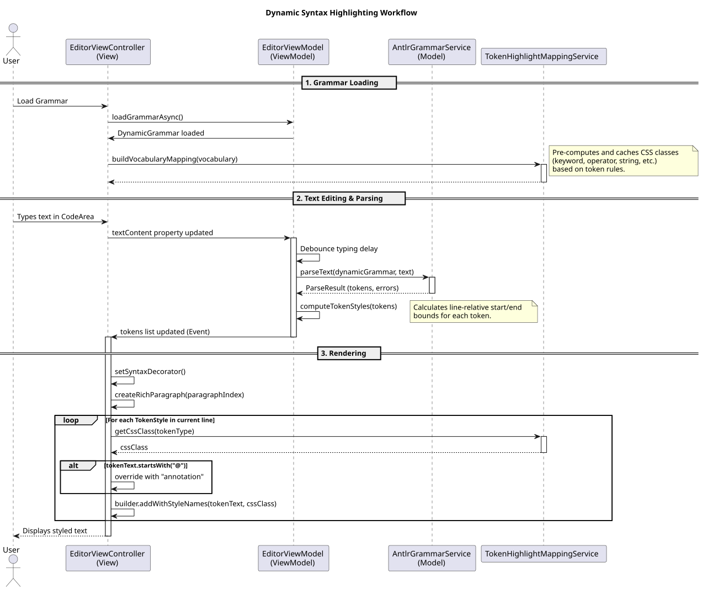

# Dynamic Syntax Highlighting Architecture

This document explains the current implementation of dynamic syntax highlighting in the `geantlr` JavaFX application.
The system is designed to provide robust, out-of-the-box syntax coloring for *any* valid ANTLR 4 grammar loaded at runtime, without requiring manually hardcoded token mappings for each grammar.

---

## 1. The Architecture (MVVM)

The highlighting process follows a strict Model-View-ViewModel (MVVM) separation of concerns:

1. **Model (ANTLR Parsing):** The raw text from the editor is parsed by the dynamically loaded ANTLR `LexerInterpreter` and `ParserInterpreter` to produce an Abstract Syntax Tree (AST) and a raw `List<Token>`.
2. **ViewModel (`EditorViewModel.java`):** Computes token bounds and delegates CSS class resolution to the mapping service. It packages this data into UI-agnostic `TokenStyle` records, storing them in a `tokenStylesByLine` map, which the View observes.
3. **View (`EditorViewController.java`):** Consumes the `TokenStyle` data and applies it to the visual components of the JavaFX 25 `CodeArea` via a `SyntaxDecorator`.

### Syntax Highlighting Workflow Diagram

The following sequence diagram illustrates the workflow when text is edited, and how syntax highlighting styles are requested from the mapper and applied to the view.



*(If viewing the source `.puml`, render using: `java -jar plantuml.jar docs/diagrams/syntax_highlighting.puml`)*

---

## 2. Dynamic Token Classification (`TokenHighlightMappingService`)

Instead of hardcoding rules (e.g., mapping `TOK_If` to `"keyword"`), the `TokenHighlightMappingService` analyzes the generic properties of an ANTLR token to classify it dynamically.

When `buildVocabularyMapping(vocabulary)` is called (typically upon loading a new grammar), the service uses the following layered heuristics to cache CSS mappings for all valid tokens:

### a) Literal Name Inspection
For keywords explicitly defined in the grammar (e.g., `WENN : 'Wenn';` or `funktionDecl : 'FUNKTION' ID;`), the service retrieves the literal string defined in the grammar via `vocabulary.getLiteralName(tokenType)`.
* If the literal name is a standard word character string (supporting Unicode via the regex `^[a-zA-Z_][a-zA-Z0-9_]*$`), it is classified as a `"keyword"`.
* If the literal name consists solely of symbols (via the regex `^[^a-zA-Z0-9_\s]+$`), it is classified as an `"operator"`.

### b) Symbolic Name Suffix/Substring Checks
If the vocabulary literal name fails to match, the service inspects the token's `symbolicName` (the uppercase rule name, e.g., `STRING_LITERAL`):
* `upperName.endsWith("_KW")` or `upperName.contains("KEYWORD")` -> `"keyword"`
* `upperName.contains("COMMENT")` -> `"comment"`
* `upperName.contains("INT")`, `"FLOAT"`, `"NUM"`, `"DIGIT"` -> `"number"`
* `upperName.contains("STRING")` or `upperName.contains("LITERAL")` -> `"string"` (Number checks are executed first to prevent accidental classification as a string).

### c) View-Level Overrides (Annotation Detection)
During actual rendering in `EditorViewController.java`, metadata annotations (e.g., `@Titel` or `@Lexer`) are identified by checking if the raw text starts with the `@` symbol. This bypasses the mapping service and hardcodes the `"annotation"` class, as ANTLR symbolic names for lexer rules cannot contain `@`.

This cascading pipeline ensures that almost any custom grammar gets a highly accurate highlighting profile by default.

---

## 3. The View Implementation (`EditorViewController`)

The JavaFX 25 Incubator `CodeArea` uses a `SyntaxDecorator` interface to apply styling. The implementation in `createSyntaxDecorator()` intercepts the process of building a `RichParagraph`.

### Safe String Segmentation
Because CSS properties (like bold or italic fonts) must be applied via CSS classes, the code *cannot* use the simpler `addHighlight(start, end, color)` method (which only accepts explicit JavaFX `Color` instances).

Instead, the string is segmented chronologically and built using `RichParagraph.Builder`:
1. The `TokenStyle` records for the line are sorted by their `startInLine` index.
2. The logic iterates through the styles, maintaining a `currentIndex` pointer.
3. **Unstyled gaps** (spaces, punctuation) between tokens are appended using `builder.addSegment(text.substring(currentIndex, start))`.
4. **Styled tokens** are appended using `builder.addWithStyleNames(tokenText, cssClass)`.
5. Strict boundary checking (`start >= currentIndex`) prevents overlapping tokens or `StringIndexOutOfBoundsException` crashes.

---

## 4. The CSS Theme (`theme.css`)

The application implements an IntelliJ "Darcula" theme by default, and a light theme fallback. The generic CSS classes returned by the mapping service (`keyword`, `string`, `number`, `comment`, `annotation`, `operator`) are styled in the global stylesheet.

**Important Rule:** The `CodeArea` requires using the `-fx-fill` property for foreground text coloring. Using `-fx-background-color` would erroneously color the block behind the text instead.

```css
.editor-code-area .content .text { -fx-fill: #a9b7c6; } /* Default Text */
.editor-code-area .keyword       { -fx-fill: #cc7832; -fx-font-weight: bold; }
.editor-code-area .string        { -fx-fill: #6a8759; }
.editor-code-area .number        { -fx-fill: #6897bb; }
.editor-code-area .comment       { -fx-fill: #808080; -fx-font-style: italic; }
.editor-code-area .annotation    { -fx-fill: #bbb529; }
.editor-code-area .operator      { -fx-fill: -geantlr-syntax-operator; }
```
